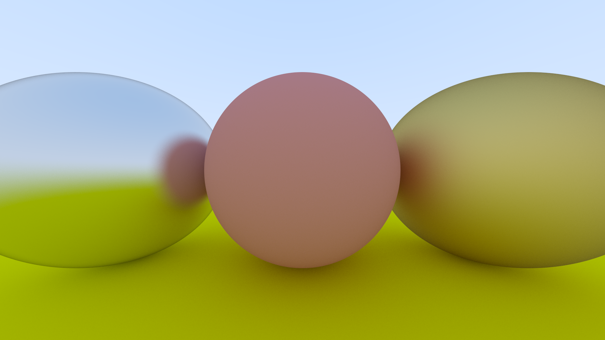
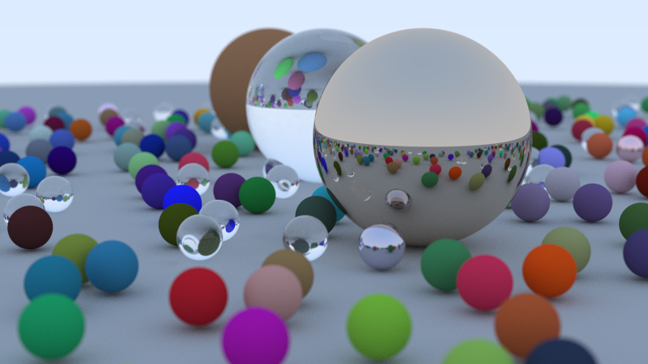

# RTX In One Weekend

## About

A guided project using the textbook "Ray Tracing in One Weekend" by Peter
Shirley. 

[_Ray Tracing in One Weekend_](https://raytracing.github.io/books/RayTracingInOneWeekend.html)

Modeling after the book, this repository is licensed under [CC0](LICENSE).

## Results

The results of this project are really quite cool, and I recommend giving this
book a read if you have any interest in computer graphics or c++. I originally
gave this project a go because I wanted to get some more familiarity with c++,
and it was a good excuse to do that. Here are some of the renders made with this
raytracer.

